# Homer


Homer is a **Slack** bot intended to help you to easily **share and follow
Gitlab merge requests**.

## Why Homer?

At ManoMano, we were a bit tired of reading Gitlab emails to try keeping up to
date with merge request updates.

Since we use Slack, we decided to create a bot that would help us to share our
merge requests to other developers and to track their progress, so we could
merge them more quickly:


## How does it work?

Homer communicates with both **Slack** and **Gitlab** to get merge request
information and publish Slack messages.


## Usage

### Commands

Here are the available commands:

| Command                                         | Description                                                                                                                                                     |
| ----------------------------------------------- | --------------------------------------------------------------------------------------------------------------------------------------------------------------- |
| `/homer changelog`                              | Display changelogs, for any Gitlab project, between 2 release tags.                                                                                             |
| `/homer project add <project_name\|project_id>` | Add a Gitlab project to a channel.                                                                                                                              |
| `/homer project list`                           | List the Gitlab projects added to a channel.                                                                                                                    |
| `/homer project remove`                         | Remove a Gitlab project from a channel.                                                                                                                         |
| `/homer release`                                | Create a release for configured Gitlab project in a channel.                                                                                                    |
| `/homer review <search>`                        | Share a merge request on a channel.<br />Searches in title and description by default.<br />Accepts merge request URLs and merge request IDs prefixed with "!". |
| `/homer review list`                            | List ongoing reviews shared in a channel.                                                                                                                       |

### Share a merge request using Homer

To share a merge request in a Slack channel using Homer, you have to follow the
following steps:

#### 1. Make Homer notified of changes happening in the Gitlab project

To keep up to date the Slack messages it creates, Homer needs to be notified
when something occurs on the related merge requests.

To do so, you need to set up a webhook in the Gitlab project of your merge
request:

- Ask for Homer's `GITLAB_SECRET` to the person that manages Homer in your
  organisation.

- Go to the `Webhooks` setting page of your Gitlab project.

  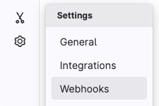

- Enter the following URL: `HOMER_BASE_URL/api/v1/homer/gitlab`.

  `HOMER_BASE_URL` should also be provided by the person that manages Homer in
  your organisation.

  

- Enter the value of `GITLAB_SECRET` in `Secret token` field.

  

- Check the following checkboxes: `Push events`, `Comments`,
  `Merge request events`.

  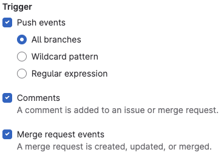

- Click on the `Add webhook` button on the bottom of the page.

  

- Make sure that the Gitlab user linked to your `GITLAB_TOKEN` has at least the
  `Developer` role in your project:
  - Go to the `Projects members` page:

    

  - Use the search bar to find the information of the user.

  - Check that the role in `Max role` is at least `Developer`.

#### 2. Add the Gitlab project to a Slack channel

If it is the first time that you share a merge request of the Gitlab project in
a Slack channel, you have to link them.

Inside the Slack channel, run one of the following commands:

- `/homer project add PROJECT_ID`
- `/homer project add PROJECT_NAME`

> [!WARNING]
> If you want to use Homer in a private channel, you need to invite it to the
> channel first.

#### 3. Share the merge request

##### Using the `/homer review` command

To share a Gitlab merge request to a Slack channel, use the
`/homer review <search>` command.

You can provide a merge request ID prefixed with `!`, e.g.: `/homer review !128`.

If you want to get an overview of merge requests that are still being reviewed
(meaning they are not merged yet), use `/homer review list`.

##### Using the `homer-review` or `homer-mergeable` gitlab label

If you want to share a merge request in a Slack channel, you can add one of the following label to your merge request:

- `homer-review`: Homer will share the merge request in the channel linked to the Gitlab project.
- `homer-mergeable`: Homer will share the merge request in the channel linked to the Gitlab project, when it is mergeable or waiting for an approval.

More information about the labels can be found in the [Gitlab documentation](https://docs.gitlab.com/user/project/labels/).

## Install

> [!NOTE]
> Homer can be installed by either manually cloning the git repository or by using the package provided.
> Check the [deploy example](./examples/deploy/) to see how to deploy using the package.

### 1. Create the Slack app

- Go to https://api.slack.com/apps/.
- Click on `Create New App`.

  

- Select `From an app manifest`.

  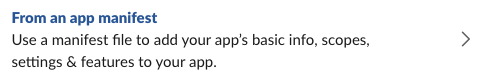

- Select the right workspace and click on `Next`.

  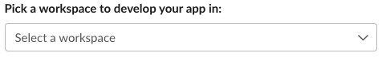

- Copy the content of [manifest.json](./manifest.json) file and paste it in the
  Slack webapp modal.

  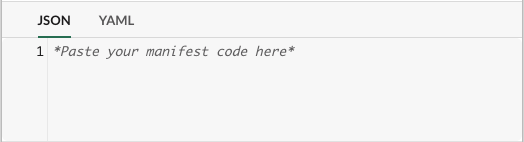

- Create the app and enjoy.

### 2. Add Slack emojis

Homer uses custom emojis when posting messages. To have them properly
displayed, you will need to add all the emojis under [emojis](./emojis) to your
Slack organisation.

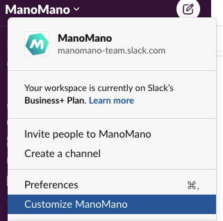

### 3. Prerequisites

Be sure to have all those installed:

- [Docker Compose](https://docs.docker.com/compose/install/).
- [Node.js@24](https://nodejs.org/en/). You can use a version manager like
  [nvm](https://github.com/nvm-sh/nvm).
- [pnpm@9](https://pnpm.io/installation). pnpm is enabled via corepack (included in Node.js 16.13+).

### 4. Set the necessary environment variables

Create a `.env` file containing the following variables:

- `API_BASE_PATH` (default value: `/api/v1/homer`)

  This is the base path that will be used to build the API URL to call homer, for example `https://homer.com<API_BASE_PATH>/command`.

- `GITLAB_SECRET`

  This is a user generated secret, so you can put any value.

  It will be used later to set up Gitlab webhooks to allow Homer to verify
  that Gitlab→Homer calls are authentic.

- `GITLAB_TOKEN`

  If you don't already have one, you need to create a project access token on
  Gitlab by following the
  [dedicated documentation](https://docs.gitlab.com/ee/user/project/settings/project_access_tokens.html#create-a-project-access-token).

  This token allows Homer to use the Gitlab API.

- `SLACK_SIGNING_SECRET`
  - Go to the [Slack apps page](https://api.slack.com/apps/) of your
    organisation.
  - Click on your app.
  - Find `Signin Secret` input in `App credentials` section.

    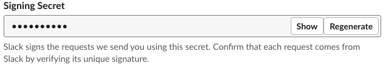

  This secret allows Homer to verify that Slack→Homer calls are authentic.

- `SLACK_BOT_USER_O_AUTH_ACCESS_TOKEN`
  - Go to the [Slack apps page](https://api.slack.com/apps/) of your
    organisation.
  - Click on your app.
  - Click on `OAuth & Permissions` in `Features` menu.

    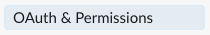

  - Copy the `Bot User OAuth Token`.

    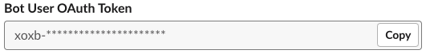

- `EMAIL_DOMAINS`

  Email domains of your organization (separated by comma),
  for instance `my-domain.com,ext.my-domain.com`.
  Used to find Slack users from Gitlab username.
  Note that this means your org has to use the same naming scheme for emails and gitlab username.

- `GITLAB_URL`

  The gitlab URL of your organization

- `TICKET_MANAGEMENT_URL_PATTERN`

  The ticket management URL pattern for your organization, this is used to generate a link to the ticket in the changelog.
  It must contain the `{ticketId}` matcher to be replaced by the ticket ID, for instance `https://my-ticket-management.com/view/{ticketId}`.

- `SLACK_SUPPORT_CHANNEL_ID`

  This slack channel id is used to build a link displayed when a user enters the help command. People having trouble with Homer can be helped on this support channel.

- `SLACK_SUPPORT_CHANNEL_NAME`

  This slack channel name is displayed when a user enters the help command. People having trouble with Homer can be helped on this support channel.

- `SLACK_CHANNEL_NOTIFICATION_THRESHOLD`

  Maximum number of channels allowed before skipping notifications. If the number of channels linked to a project exceeds this threshold, no notifications will be sent. Default value is `3`.

If you want Homer to connect to an **external PostgreSQL database**, you can set
the following variables:

- `POSTGRES_DATABASE_NAME`: database name. Default value is `homer`.
- `POSTGRES_HOST`: host of the database.
- `POSTGRES_PASSWORD`: password used when connecting to the database.
- `POSTGRES_PORT`: port where the database listens. Default value is `5432`.
- `POSTGRES_USER`: username used when connecting to the database. Default value is `homer`.

### 5. Install and run

```bash
# Clone the repo
git clone https://github.com/ManoManoTech/homer.git

# Go to directory that was just created
cd homer

# Enable pnpm (if not already enabled)
corepack enable

# Install dependencies
pnpm install

# Start the database Docker container
docker compose up -d

# Build Homer
pnpm build

# Start Homer
pnpm start
```

To check that Homer is working properly, you can go to
http://localhost:3000/api/monitoring/healthcheck and check that a donut is
displayed.

### 6. Make your local instance of Homer reachable from outside

- On another terminal, open an HTTP bridge using [ngrok](https://ngrok.com/):
  `npx ngrok http localhost:3000`.
- Copy the `Forwarding` URL (ex: `https://d59a-176-179-182-210.ngrok.io`).
- Go to the [Slack apps page](https://api.slack.com/apps/) of your organisation.
- Click on your app.
- Click on `Interactivity & Shortcuts` in `Features` menu.

  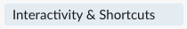

- In `Request URL`, replace `https://HOMER_BASE_URL` by the URL you copied
  above.

  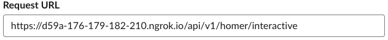

- Click on `Save Change` button.

  

- Click on `Slash Commands` in `Features` menu.

  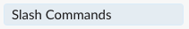

- Click on edit button.

  

- In `Request URL`, replace `https://HOMER_BASE_URL` by the URL you copied
  above.

  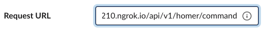

- Click on `Save` button.

  

You should now be able to use Homer commands on Slack 🎉

### 7. Configure releases

Releases management can be configured in `config/homer/projects.json`.
Here is a sample configuration with one project:

```json
{
  "projects": [
    {
      "description": "project_example",
      "notificationChannelIds": ["C0XXXXXXXXX"],
      "projectId": 1148,
      "releaseChannelId": "C0XXXXXXXXX",
      "releaseManager": "defaultReleaseManager",
      "releaseTagManager": "stableDateReleaseTagManager"
    }
  ]
}
```

### 8. Add your own release manager

A simple plugin system enables the addition of custom release managers. See this dedicated [page](./PLUGIN_RELEASE.md) for more details.

### 9. Examples

You can find some [examples](./examples/) to add your own configuration, plugins and how to deploy.

## Contributing

See [CONTRIBUTING.md](./CONTRIBUTING.md).
